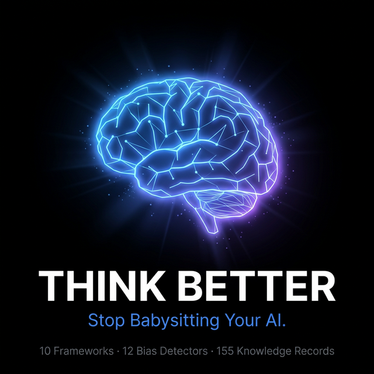

<div align="center">



# Think Better

**Your AI writes code fast but makes terrible decisions.**<br>
Think Better injects structured decision frameworks directly into your AI prompts.

[](https://golang.org)
[](LICENSE)
[](.)
[](.)  
[](.)
[](.)
[](.)

[Website](https://thinkbetter.dev/) · [Documentation](USER-GUIDE.md) · [Quick Reference](QUICK-REFERENCE.md) · [Contributing](CONTRIBUTING.md)

**Works with** Claude · GitHub Copilot · Antigravity

</div>

<br>

## The Problem

You ask your AI *"Should we migrate to microservices?"* and get a generic pros/cons list. No framework. No bias detection. No structured analysis. Just vibes.

**Think Better fixes this.** It gives your AI access to 10 decision frameworks, 15 decomposition methods, 12 cognitive bias detectors, and 160 knowledge records — turning surface-level responses into structured, rigorous analysis.

<br>

## Quick Start

```bash
# macOS / Linux
curl -sSL https://raw.githubusercontent.com/HoangTheQuyen/think-better/main/install.sh | bash

# Windows (PowerShell)
irm https://raw.githubusercontent.com/HoangTheQuyen/think-better/main/install.ps1 | iex
```

Then install skills for your AI:

```bash
think-better init --ai claude        # Claude Code
think-better init --ai copilot       # GitHub Copilot
think-better init --ai antigravity   # Antigravity
```

> **Other install methods:** `go install github.com/HoangTheQuyen/think-better/cmd/make-decision@latest` or clone & `make build`

<br>

## How It Works

Just talk to your AI naturally. Think Better auto-activates when it detects a decision or problem:

```
You: "Should we migrate from React to Next.js for our main app?"

AI:  → Detects: Binary Choice
     → Framework: Reversibility Filter
     → Warns: Overconfidence Bias, Status Quo Bias, Sunk Cost
     → Generates: Weighted comparison matrix + action plan
```

```
You: "Revenue dropped 20% despite market growth"

AI:  → Detects: Opportunity Gap
     → Decomposition: Profitability Tree (MECE)
     → Analysis: Root Cause (5 Whys) + Fermi Estimation
     → Warns: Anchoring Bias, Confirmation Bias
```

<br>

## Two Skills

### `/decide` — For Choices

> *"choose", "compare", "should I", "pros and cons", "nên chọn cái nào", "phân vân"*

| | |
|---|---|
| **10 Frameworks** | Reversibility Filter, Weighted Matrix, Hypothesis-Driven, Pre-Mortem, Pros-Cons-Fixes... |
| **12 Bias Warnings** | Overconfidence, Anchoring, Sunk Cost, Status Quo, Confirmation... |
| **Comparison Matrix** | `--matrix "A vs B vs C"` with weighted scoring |
| **Decision Journal** | Track → Review → Improve calibration |

### `/solve` — For Problems

> *"solve", "debug", "root cause", "I'm stuck", "tại sao bị vậy", "không biết làm sao"*

| | |
|---|---|
| **7-Step Method** | Define → Decompose → Prioritize → Analyze → Synthesize → Communicate |
| **15 Decomposition Frameworks** | Issue Tree, MECE, Hypothesis Tree, Profitability Tree, Systems Map... |
| **12 Mental Models** | First Principles, Inversion, Bayesian Updating, Pareto... |
| **10 Communication Patterns** | Pyramid Principle, BLUF, SCR, Action Titles... |

<br>

## Depth Levels

Control analysis depth with slash commands:

| Command | Depth | Records | Best For |
|---------|-------|---------|----------|
| `/solve.quick` · `/decide.quick` | Quick | 0.5× | Fast scan, simple problems |
| `/solve` · `/decide` | Standard | 1.0× | Default for most situations |
| `/solve.deep` · `/decide.deep` | Deep | 1.7× | Complex, high-stakes decisions |
| `/solve.exec` · `/decide.exec` | Executive | 2.5× | Board reports, stakeholder briefings |

**Examples:**
```
/solve.quick API latency spiked after deploy
/decide.deep AWS vs Azure vs GCP for cloud migration
/solve.exec Revenue declined 20% quarter over quarter
```

<br>

## Architecture

```
YOU ─── "Revenue dropped 20%" ──────────────────────────────────┐
                                                                │
  ┌─────────────────────────────────────────────────────────────▼──┐
  │  AI ASSISTANT (Claude / Copilot / Antigravity)                 │
  │                                                                │
  │  ┌─ Auto-detect ──────────┐    ┌─ Slash Command ────────────┐ │
  │  │ SKILL.md triggers      │ OR │ /solve.deep → deep mode    │ │
  │  │ "solve" → problem-pro  │    │ /decide.quick → quick mode │ │
  │  └────────────┬───────────┘    └────────────┬───────────────┘ │
  │               └───────────┬────────────────┘                  │
  │                           ▼                                    │
  │  ┌────────────────────────────────────────────────────────┐   │
  │  │  🐍 BM25 Search Engine                                 │   │
  │  │  160 records × depth multiplier (0.5× → 2.5×)         │   │
  │  └────────────────────────┬───────────────────────────────┘   │
  │                           ▼                                    │
  │  ┌────────────────────────────────────────────────────────┐   │
  │  │  📋 Advisor Engine                                      │   │
  │  │  Classify → Framework → Bias Detection → Plan          │   │
  │  └────────────────────────┬───────────────────────────────┘   │
  │                           ▼                                    │
  │  📄 Structured Output + Next-step suggestions                 │
  └───────────────────────────────────────────────────────────────┘
```

<br>

## Step-by-Step Workspace

Add *"save step-by-step"* to any prompt to generate a full markdown workspace:

```
solving-plans/project/               decision-plans/project/
├── 00-OVERVIEW.md                   ├── 00-OVERVIEW.md
├── 01-PROBLEM-DEFINITION.md         ├── 01-DECISION-TYPE.md
├── 02-DECOMPOSITION.md              ├── 02-FRAMEWORK.md
├── 03-PRIORITIZATION.md             ├── 03-CRITERIA.md
├── 04-ANALYSIS-PLAN.md              ├── 04-ANALYSIS.md
├── 05-FINDINGS.md                   ├── 05-OPTIONS.md
├── 06-SYNTHESIS.md                  ├── 06-DECISION.md
├── 07-RECOMMENDATION.md             ├── BIAS-WARNINGS.md
├── BIAS-WARNINGS.md                 └── DECISION-LOG.md
└── DECISION-LOG.md
```

<br>

## CLI Commands

```bash
think-better init             # Install skills for your AI
think-better list             # Show installed skills
think-better check            # Verify prerequisites (Python 3)
think-better uninstall        # Remove skills
think-better version          # Show version
```

<br>

## Project Structure

```
think-better/
├── cmd/make-decision/           # CLI entry point (Go)
├── internal/                    # Core logic
│   ├── skills/                  # Skill registry + embedded data
│   ├── targets/                 # AI platform definitions
│   ├── installer/               # Install/uninstall logic
│   └── cli/                     # Command handlers
├── .agents/
│   ├── skills/
│   │   ├── make-decision/       # Decision skill (SKILL.md, scripts, CSVs)
│   │   └── problem-solving-pro/ # Problem-solving skill
│   └── workflows/               # Slash command definitions
└── specs/                       # Specifications
```

**Stats:** 13 Go files · 7 Python scripts · 16 CSVs (160 records) · 8 workflows

<br>

## Requirements

| Method | Requirements |
|--------|-------------|
| Binary download | None — just run |
| `go install` | Go 1.25+ |
| Build from source | Go 1.25+ |
| Running skills | Python 3 |

<br>

## Contributing

See [CONTRIBUTING.md](CONTRIBUTING.md) for guidelines.

<br>

---

<div align="center">

# 🇻🇳 Tiếng Việt

**Ngừng Đoán Mò. Bắt Đầu Tư Duy Có Cấu Trúc.**

AI viết code nhanh nhưng ra quyết định tệ.<br>
Think Better tiêm framework tư duy vào prompt — biến AI thành Staff Engineer.

</div>

### Cài Đặt

```bash
# macOS / Linux
curl -sSL https://raw.githubusercontent.com/HoangTheQuyen/think-better/main/install.sh | bash

# Windows
irm https://raw.githubusercontent.com/HoangTheQuyen/think-better/main/install.ps1 | iex

# Cài skill
think-better init --ai claude
```

### Cách Dùng

Nói chuyện với AI bình thường — Think Better tự kích hoạt:

| Bạn Nói | AI Làm |
|---------|--------|
| *"Nên chọn công ty lớn hay startup?"* | `make-decision` → Weighted Matrix, cảnh báo Status Quo Bias |
| *"So sánh React vs Vue vs Angular"* | Bảng so sánh với tiêu chí có trọng số |
| *"Tại sao doanh thu giảm?"* | `problem-solving-pro` → Issue Tree, Root Cause Analysis |
| *"Bị kẹt, không biết làm sao"* | 7 bước: Định nghĩa → Phân tách → Ưu tiên → Phân tích |

### 2 Skill

**`/decide`** — Chọn lựa
- 10 framework · 12 bias · So sánh đa tiêu chí · Nhật ký quyết định

**`/solve`** — Giải quyết vấn đề
- 7 bước McKinsey · 15 framework phân tách · 12 mô hình tư duy

### Slash Commands

| Lệnh | Khi Nào |
|------|---------|
| `/solve.quick` · `/decide.quick` | Scan nhanh |
| `/solve` · `/decide` | Phân tích chuẩn |
| `/solve.deep` · `/decide.deep` | Phức tạp, high-stakes |
| `/solve.exec` · `/decide.exec` | Báo cáo cho leadership |

```
/solve.quick API chậm sau deploy
/decide.deep Nên dùng AWS hay Azure hay GCP?
```

### Lưu Ý

- Knowledge base tiếng Anh — AI tự dịch keyword trước khi search
- Cần **Python 3** cho script phân tích
- Hỗ trợ **Claude, Copilot, Antigravity**

---

<div align="center">

**MIT License** · Built by [HoangTheQuyen](https://github.com/HoangTheQuyen)

**[⭐ Star](https://github.com/HoangTheQuyen/think-better)** if Think Better helped you think better.

</div>
